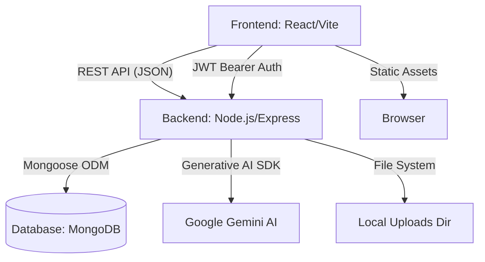
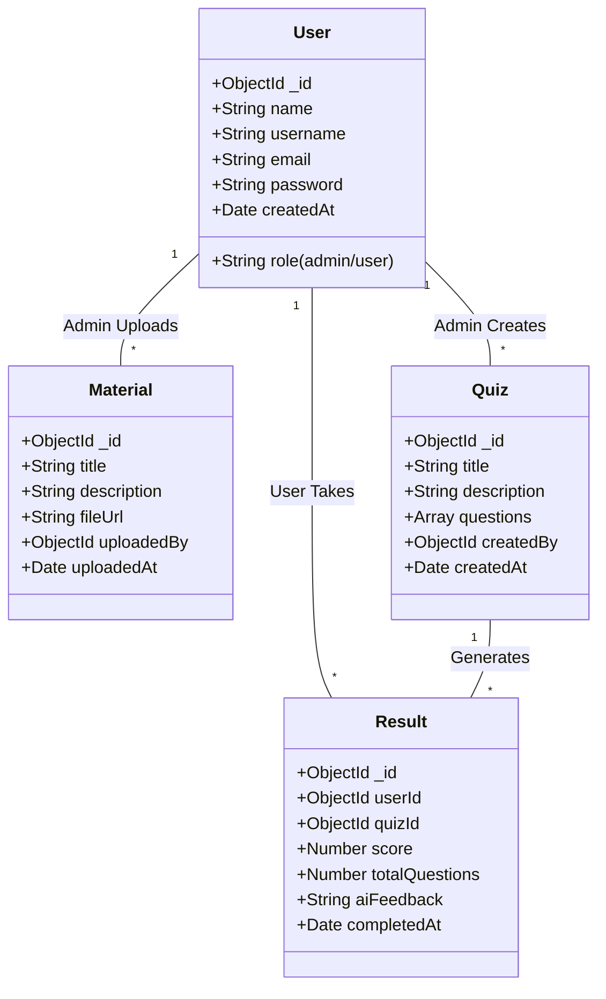

# LearnAssess

## Description
LearnAssess is a comprehensive, AI-powered learning and assessment platform designed to bridge the gap between traditional education and modern, data-driven learning. It provides a seamless interface where students can access educational materials, challenge themselves with interactive quizzes, and receive instant, personalized AI-driven feedback. Concurrently, administrators and educators are equipped with robust tools to manage resources, create assessments, and monitor student progress through detailed analytics.

## Why it is used and what problem it solves
Traditional educational platforms often lack scalable personalization. Students take tests and wait for generic feedback, while teachers struggle to manually analyze the learning gaps of every individual student. 

**LearnAssess solves this by:**
1. **Automating Feedback:** Leveraging Google's Gemini AI to instantly analyze quiz results and provide tailored, constructive feedback to the student.
2. **Centralizing Learning:** Acting as a single hub for course materials (PDFs) and assessments.
3. **Providing Actionable Insights:** Giving both users and administrators real-time data visualization of scores and progress, ensuring that learning is measurable and continuous.

## Describe the functionalities
- **Secure Authentication:** Role-based access control segregating Users (students) and Admins (educators).
- **Admin Dashboard:**
  - Upload and manage learning materials (PDFs).
  - Create, edit, and delete dynamic quizzes.
  - View platform-wide analytics and individual user progress.
- **User (Student) Dashboard:**
  - Access and read course materials via an embedded document viewer.
  - Take interactive, timed or untimed quizzes.
  - View personal score analytics through interactive charts.
- **AI-Powered Insights:** Automatically generates personalized feedback summaries after a quiz is completed, highlighting strengths and areas for improvement.
- **Responsive UI/UX:** A stunning, light-themed modern interface with glassmorphic elements, smooth framer-motion animations, and intuitive navigation.

## Tech stack used and functionalities
### Frontend
- **React.js (Vite):** Core framework for building a fast, component-based user interface.
- **React Router DOM:** For seamless Single Page Application (SPA) navigation.
- **Framer Motion:** For fluid, modern UI animations and page transitions.
- **Lucide React:** For clean, scalable iconography.
- **Chart.js & React-Chartjs-2:** For rendering interactive data visualizations (progress charts).
- **React-PDF:** For embedding and viewing uploaded course materials natively in the browser.

### Backend
- **Node.js & Express.js:** Robust server infrastructure for handling REST API requests.
- **MongoDB & Mongoose:** NoSQL database for flexible data modeling of users, quizzes, materials, and results.
- **JWT (JSON Web Tokens) & Bcryptjs:** For secure password hashing and stateless user authentication.
- **Multer:** Middleware for handling multipart/form-data, used for uploading PDF files.
- **@google/generative-ai:** Integration with Gemini AI to generate automated quiz feedback.

## Architectural diagram



## Class Diagram (Data Schema)



## Folder structure

```text
LearnAssess/
├── Client/                 # Frontend React Application
│   ├── public/             # Static assets (images, logos)
│   ├── src/
│   │   ├── components/     # Reusable UI components (common, user, admin)
│   │   ├── context/        # React Context (AuthContext, DataContext)
│   │   ├── pages/          # Page views (Home, Login, Signup, Admin, User)
│   │   ├── styles/         # Global CSS styles and variables
│   │   ├── App.jsx         # Main application routing
│   │   └── main.jsx        # React entry point
│   ├── package.json        # Frontend dependencies
│   └── vite.config.js      # Vite build configuration
│
├── Server/                 # Backend Express Application
│   ├── middleware/         # Express middlewares (auth, upload routing)
│   ├── models/             # Mongoose schemas (User, Material, Quiz, Result)
│   ├── routes/             # Express API routes
│   ├── uploads/            # Local file storage for uploaded materials
│   ├── utils/              # Helper functions (AI generation logic)
│   ├── server.js           # Express entry point & DB connection
│   └── package.json        # Backend dependencies
│
└── README.md               # Project documentation
```

## Setup Instructions

1. **Clone the repository**
2. **Setup Server:**
   - `cd Server`
   - `npm install`
   - Create a `.env` file with `PORT`, `MONGO_URI`, `JWT_SECRET`, and `GEMINI_API_KEY`.
   - `npm start`
3. **Setup Client:**
   - `cd Client`
   - `npm install`
   - Create a `.env` file with `VITE_API_URL`.
   - `npm run dev`